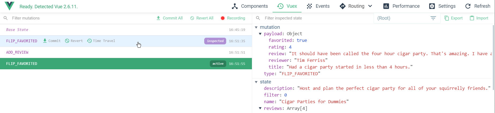
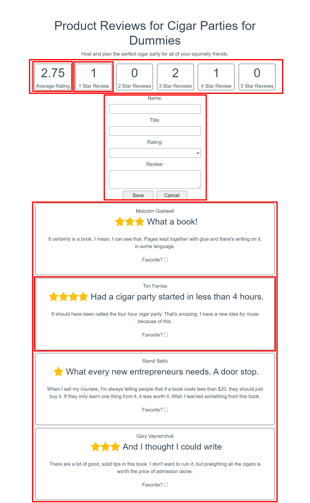
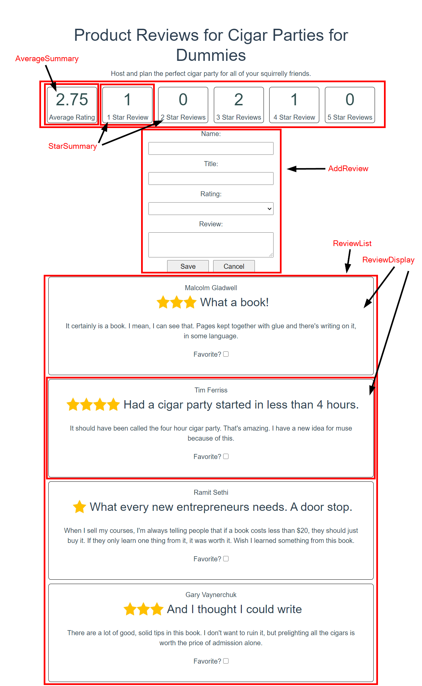
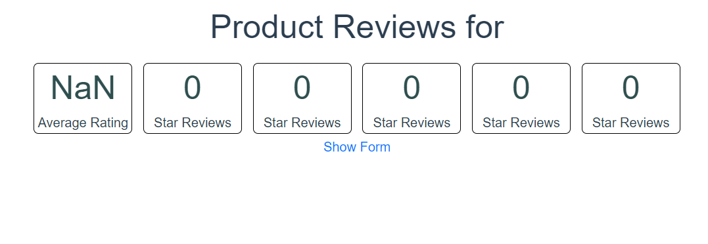
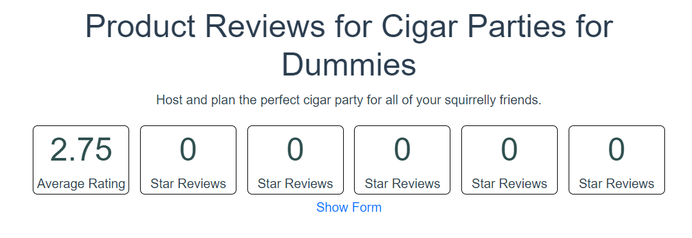
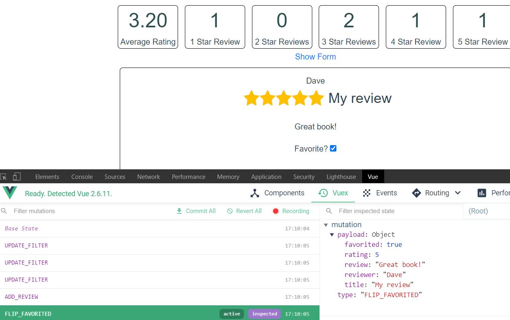
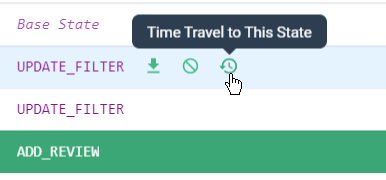
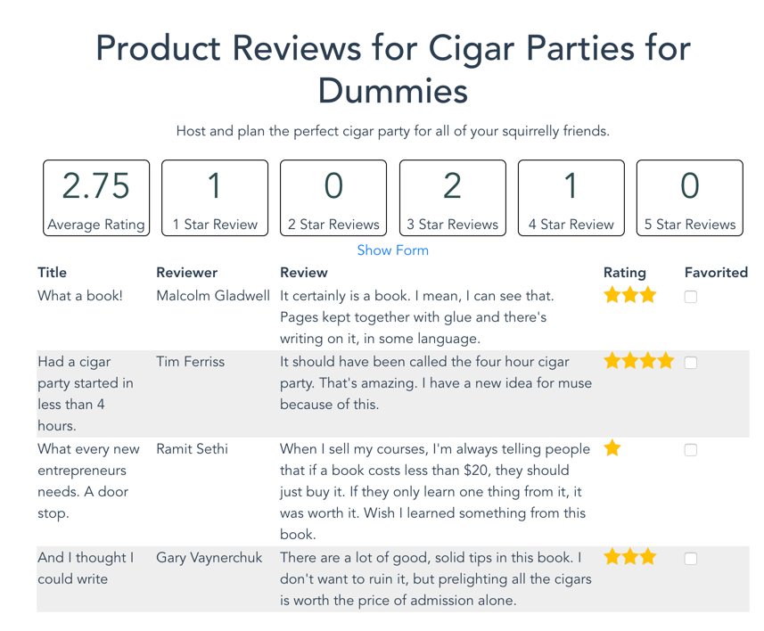

# Lecture Code Walkthrough

## Why mutations

The student book pointed out the fact that any change to state should be done in a mutation. Some students—even yourself—might ask "Why?" This section prepares you to answer this question, and any others, that might come up during lecture.

Using mutations is an example of the **Single Responsibility Principle**. As the student book says, you should make your components only do one thing, and mutations are the only place where changes to state should occur. If you follow the convention of always changing state with a mutation, then you'll always know where the state is being changed in your application.

Look at this example from the product reviews application. If you're iterating over a list of reviews and want to display a checkbox that favorites the review, how would you do it? Your first response might be to use `v-model`:

```html
Favorite? <input type="checkbox" v-model="review.favorited" />
```

This works, but there's a problem with this approach. If you check or uncheck the checkbox, you're updating state from the component itself. Now imagine that this checkbox is part of a component that's alongside several other components in your application, each one updating state in their code. If you're trying to troubleshoot an issue where your data—meaning state—isn't correct, you may find yourself looking through a dozen different components and all their methods.

Another benefit of using Vuex, mutations, and the Vue DevTools is time travel. As mutations are committed, the Vue DevTools records the state before and after each one. Now if you need to debug a state problem, you can inspect all the mutations that have occurred:



There's an opportunity to show the time travel debugging later in the lecture.

Hopefully, this clears up some questions that might come up related to mutations.

## Breaking a component into multiple components

In the previous lecture, you saw a single component called `ProductReview.vue` that was responsible for:

- Displaying rating totals
  - Average Rating
  - Number of Stars (1-5)
- Listing Product Reviews
- Displaying Review Details for each Review
- Adding a New Review
- Filtering Reviews by rating
- Marking Reviews as Favorite

The final component `/src/components/ProductReview.vue` from the previous lecture is in the lecture-final and the student-lecture starting code. This is a great opportunity to use the whiteboard and see if students can identify how to break this component down into multiple components.

Since the application has already been modified to use the new components, you can show the students this screenshot for your discussion:


Some expected answers from the students might include:

- Star ratings/filters
  - This can be broken down further: 1-5 stars boxes can be the same component, with the star rating passed as a prop
- Add new review form
- List of reviews
  - This can also be broken down further with a component responsible for rendering a single review



The following components have been provided but need some additional code to access the data from the Vuex datastore. You'll walk the students through making these modifications:

- `/src/components/AverageSummary.vue` - Displaying average rating
- `/src/components/StarSummary.vue` - Displaying star totals
- `/src/components/AddReview.vue` - Adding a new review
- `/src/components/ReviewList.vue` - Listing product reviews and filtering by rating
- `/src/components/ReviewDisplay.vue` - Displaying review details for each review

## Starting code

Start by walking through the current application. The curriculum team already refactored the component into multiple components. Make sure to spend enough time in each component so the students understand that the code is essentially what used to be in `ProductReview`. *The code that interacts with Vuex will be completed during lecture*.

You may also show them this diagram to see which parts of the page went into which component:



### Vuex

Vuex was already added to the application by running `vue add vuex`. If the students want a refresher on this, there's a section in the student book about it. You can go into `/src/store/index.js` to look at the current configuration of the store to make sure they understand what `state` and `mutations` are doing.

The `state` section contains most of the same data properties that were in `ProductReview`: `name`, `description`, `filter`, and `reviews`. Properties like `newReview` and `showForm` don't need to be shared among components, so they exist only in the component that needs it: `AddReview`.

### AverageSummary.vue

This component is responsible for displaying the average star rating. When clicked, it resets the filter to show all reviews.

In the component, you'll see there's an empty method, `updateFilter()` and a computed property, `averageRating`. The `updateFilter()` method commits a mutation to reset the filter.

The code in the `averageRating` computed property is similar to the code in `ProductReview.vue`, except that `reviews` is an empty array for now. It originally got the reviews from the in-component `reviews` array, but it'll be coming from Vuex in a few minutes.

### StarSummary.vue

This component is responsible for displaying the number of ratings for each amount of stars. It's the same component for 1-5 stars.

In the component, you'll see the same empty method, `updateFilter()` and a computed property, `numberOfReviews`. Like `AverageSummary.vue`, the `updateFilter()` method commits a mutation to set the filter.

The `numberOfReviews` computed property is similar to the code that was in the `numberOfReviews` method in `ProductReview.vue`, except that `reviews` is an empty array for now. It originally got the reviews from the in-component `reviews` array, but it'll be coming from Vuex in a few minutes.

Also, make sure to point out to the students that this component also receives a prop named `rating`. This is passed in to the component so it can be re-used for each different star amount. This makes the component reusable.

### AddReview.vue

This component is responsible for displaying the form to add a new review and saving it. The component is also similar to the code in `ProductReview.vue`, except that the `addNewReview` method needs to be completed, so it commits a mutation to add a new review.

### ReviewList.vue

This component is only responsible for iterating over the array of reviews. This component creates a `ReviewDisplay` component for each item in the array.

The `filteredReviews` computed property of `ReviewList.vue` needs to retrieve the filter and reviews from the Vuex datastore.

### ReviewDisplay.vue

This component is responsible for laying out the details of the review.

The `onFavoritedChange` method needs to be completed to save the change of marking a review as a favorite.

> Note to instructor: you may find getting and saving data to and from the datastore a bit repetitive. The purpose of doing this is to not give the answers away.

### App.vue

In `App.vue`, you can see the `AverageSummary`, `StarSummary`, `AddReview`, and `ReviewList` components, as well as the `<h1>` for the title and a `<p>` for the description, but they're incomplete. That is retrieved from the datastore as well.

## Writing code: retrieving data and committing mutations

Start the application using `npm install` and `npm run serve`. You won't see much at first:



### App.vue: name and description

Start by revisiting `App.vue` and fill in the title and description. Ask the students what code is needed to retrieve the `name` and `description` properties from the Vuex datastore. If it helps to re-open `store\index.js` again, do so.

What you're looking for is `$store.state.name` and `$store.state.description`. Have them also tell you that you need the double curly braces to display the property in the `<template>` section.

`this` isn't required for accessing `$store` in the `<template>` section, same as when using regular in-component properties:

```html
<h1>Product Reviews for {{ $store.state.name }}</h1>
<p class="description">{{ $store.state.description }}</p>
```

### AverageSummary.vue: averageRating and updateFilter

Next, work on `AverageSummary.vue`. Start with the computed property `averageRating`. This needs one modification to retrieve the `reviews` array from the Vuex datastore. Ask the students how you do this.

What you're looking for in this case is `const reviews = this.$store.state.reviews;`. Note the `this`.

Now that the `averageRating` property has the reviews, it displays the average score rating again. You can show this in the browser.

Next, you need to be able to set the `filter` property. Back when all the code was in the same component—meaning `ProductReview`—the `filter` property was set by the `v-on:click` event handlers and stored in the component. But now, multiple components need to be able to read it and set it.

Ask the students, "How do you make change to properties in Vuex? Can you set it by using `this.$store.state.filter = 0`?"

Technically, you can, but that's not the way you're supposed to do it. If you do use `this.$store.state.filter = 0`, your application may not behave as you expected.

Data is changed, or "mutated", by mutations. Mutations are made by "committing" them to the Vuex datastore. You can make an analogy to "committing" your code in git—once you've committed your code, other developers can access it. Similarly, with Vuex, once data is committed, other components can access it.

Vuex mutation commits are accomplished by the `this.$store.commit()` method. The method takes two parameters. The first is a string that's the name of the mutation in the `mutations` section of `store\index.js`. The second parameter is the data that has been changed.

Show the students the `mutations` in `store\index.js`. Can the students identify the mutation for updating the filter property?

The answer is `UPDATE_FILTER`. The students may ask you where the `state` parameter comes from. That's automatically supplied to the mutation methods. It gives it access to the Vuex `state` where data is stored.

The solution to setting the `filter` property by mutation is:

```js
updateFilter() {
  this.$store.commit("UPDATE_FILTER", 0);
}
```

### StarSummary.vue: numberOfReviews and updateFilter

In `StarSummary.vue`, the solution for accessing the `reviews` in `numberOfReviews` is the same as `AverageSummary`: `const reviews = this.$store.state.reviews;`.

The `updateFilter` method is slightly different. Since this component is used for all the star levels, you can't hard-code a value. However, there's a `prop` being passed to this component that's the number of stars—`rating`. You'll have to make sure to parse `rating` to a number, because it defaults as a string and the filtering won't work:

```js
updateFilter() {
  this.$store.commit("UPDATE_FILTER", parseInt(this.rating));
}
```

Now, load the page again in the browser. Point out that all the star review boxes still show zero reviews:



Can any of the students figure it out? If they need a hint, tell them to look at `App.vue`. The `rating` prop isn't being sent to the components. Add the `rating` prop to each of the `<star-summary>` tags:

```html
<star-summary rating="1" />
<star-summary rating="2" />
<star-summary rating="3" />
<star-summary rating="4" />
<star-summary rating="5" />
```

Now the star review boxes contain the number of reviews.

### AddReview.vue: addNewReview

The `addNewReview` method saves a new review to the datastore. Previously in `ProductReview`, the new review was added to the in-component `reviews` property. Again, multiple components need to read the `reviews` array—you just saw that in the `AverageSummary` and `StarSummary` components.

Can any of the students identify the code that needs to be written? What's the mutation name? What data goes in the second parameter?

The mutation name is `ADD_REVIEW` and the data is `this.newReview`:

```js
addNewReview() {
  this.$store.commit("ADD_REVIEW", this.newReview);
  this.resetForm();
}
```

If it helps, you can show the `mutations` section of `store\index.js` again. `ADD_REVIEW` takes the `review` object and adds it to the beginning of the `reviews` array:

```js
ADD_REVIEW(state, review) {
  state.reviews.unshift(review);
}
```

### ReviewList.vue: filteredReviews

This is where things may get a little repetitive. The `filteredReviews` method needs both the `filter` value and the `reviews` array:

```js
filteredReviews() {
  const reviewsFilter = this.$store.state.filter;
  const reviews = this.$store.state.reviews;
  return reviews.filter(review => {
    return reviewsFilter === 0 ? true : reviewsFilter === review.rating;
  });
}
```

Feel free to point out to the students that they don't always need to set a value from the datastore to a variable. It can be used in the code like any other property. Using `reviews` in this example:

```js
const reviewsFilter = this.$store.state.filter;
return this.$store.state.reviews.filter(review => {
  return reviewsFilter === 0 ? true : reviewsFilter === review.rating;
});
```

The code was written the first way so it wouldn't throw errors before getting to this part.

### ReviewDisplay.vue: onFavoritedChange

The `onFavoritedChange` method needs to be completed. This method commits a mutation to save the change to the datastore. It needs to run when the "Favorite?" checkbox is checked. This is some reinforcement of event handling from the previous day. Ask the students how can you run this method when the checkbox is checked/unchecked. The answer is the `v-on:change` attribute:

```html
<input
  type="checkbox"
  v-bind:checked="review.favorited"
  v-on:change="onFavoritedChange"
/>
```

That's almost it, but how will the code know which review needs to be updated? You'll pass it the `review` object:

```html
<input
  type="checkbox"
  v-bind:checked="review.favorited"
  v-on:change="onFavoritedChange(review)"
/>
```

Add the `review` parameter to the `onFavoritedChange` method:

```js
onFavoritedChange(review) {

}
```

The mutation name is `FLIP_FAVORITED` and is passed the `review`:

```js
onFavoritedChange(review) {
  this.$store.commit("FLIP_FAVORITED", review);
}
```

## Time travel

You now have a fully functioning application like the lecture from the previous day. Take a moment to demonstrate filtering first, then add a review. Then open the Vue DevTools in the Chrome or Firefox DevTools. In the Vuex tab, you'll see all the mutations you made:



Hover over a mutation from before you added the review, and click the "Time Travel" button:



When you click on it, your review disappears and the ratings return to their previous values.

## Review table and table row components

Now that you've gone through all of the components and the students understand how everything works, it's time to write a few components together. The current application displays the list of reviews in a card-like format. You've been tasked with creating a new table layout. When you're done, you end up with something like this:



The final solution has two components:

- `/src/components/ReviewTable.vue`
- `/src/components/ReviewTableRow.vue`

You could build this out in a single component first, and then ask the students how they might further break this down and why. A starter `ReviewTable.vue` component is in the `/src/components` directory and contains some styles to help make the table look nice.

Below is what the component could look like if you put all of the logic into a single component. If you look in the `lecture-final` folder, you'll see how it can be split into two components:

```html
<template>
  <table>
    <thead>
      <tr>
        <th>Title</th>
        <th>Reviewer</th>
        <th>Review</th>
        <th>Rating</th>
        <th>Favorited</th>
      </tr>
    </thead>
    <tbody>
      <tr v-for="review in filteredReviews" v-bind:key="review.title">
        <td>{{ review.title }}</td>
        <td nowrap>{{ review.reviewer }}</td>
        <td>{{ review.review }}</td>
        <td class="stars">
          
        </td>
        <td>
          <input
            type="checkbox"
            v-bind:checked="review.done"
            v-on:change="onFavoritedChange(review)"
          />
        </td>
      </tr>
      <tr v-show="filteredReviews.length == 0">
        <td colspan="5">There are no reviews</td>
      </tr>
    </tbody>
  </table>
</template>

<script>
  export default {
    name: 'review-table',
    methods: {
      onFavoritedChange(review) {
        this.$store.commit('FLIP_FAVORITED', review);
      }
    },
    computed: {
      filteredReviews() {
        const reviewsFilter = this.$store.state.filter;
        return this.$store.state.reviews.filter(review => {
          return reviewsFilter === 0 ? true : reviewsFilter === review.rating;
        });
      }
    }
  };
</script>

<style style="scoped">
  th,
  td {
    text-align: left;
  }
  td {
    padding-right: 10px;
    vertical-align: top;
  }
  tr:nth-child(even) {
    background-color: rgb(238, 238, 238);
  }
  .stars {
    display: flex;
  }
</style>
```

